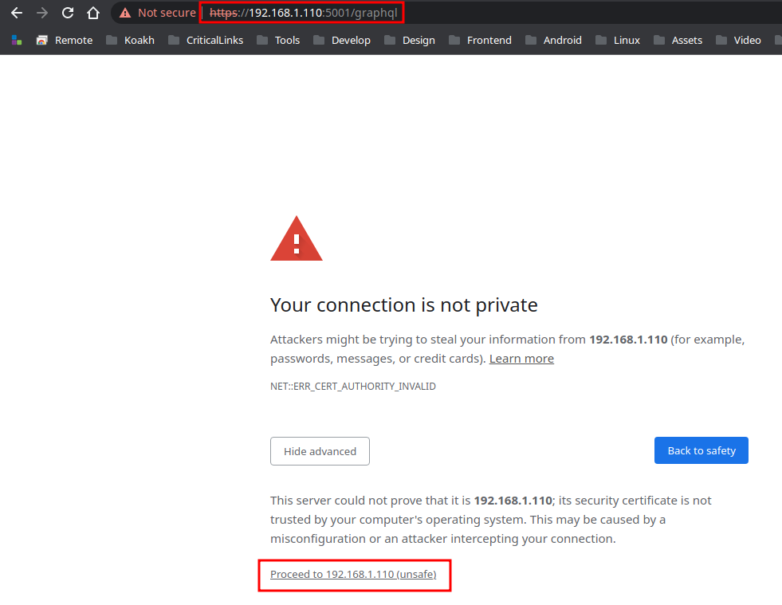
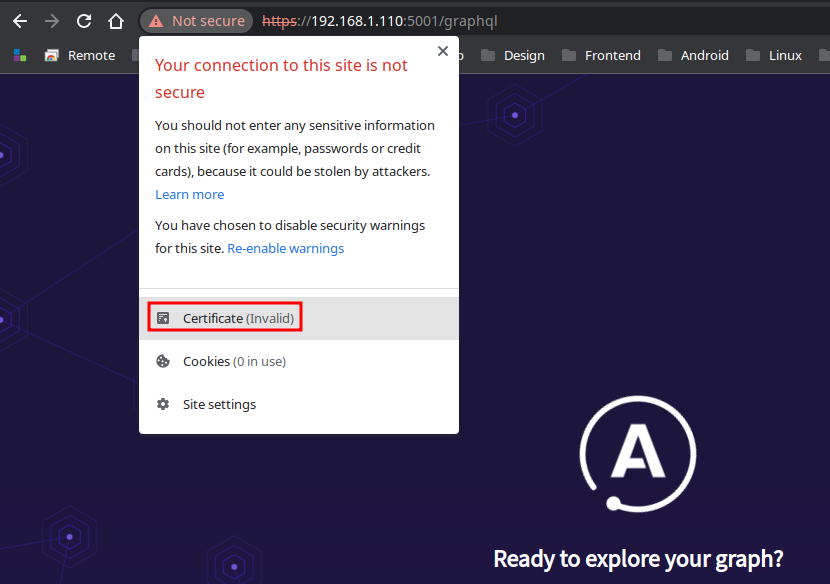
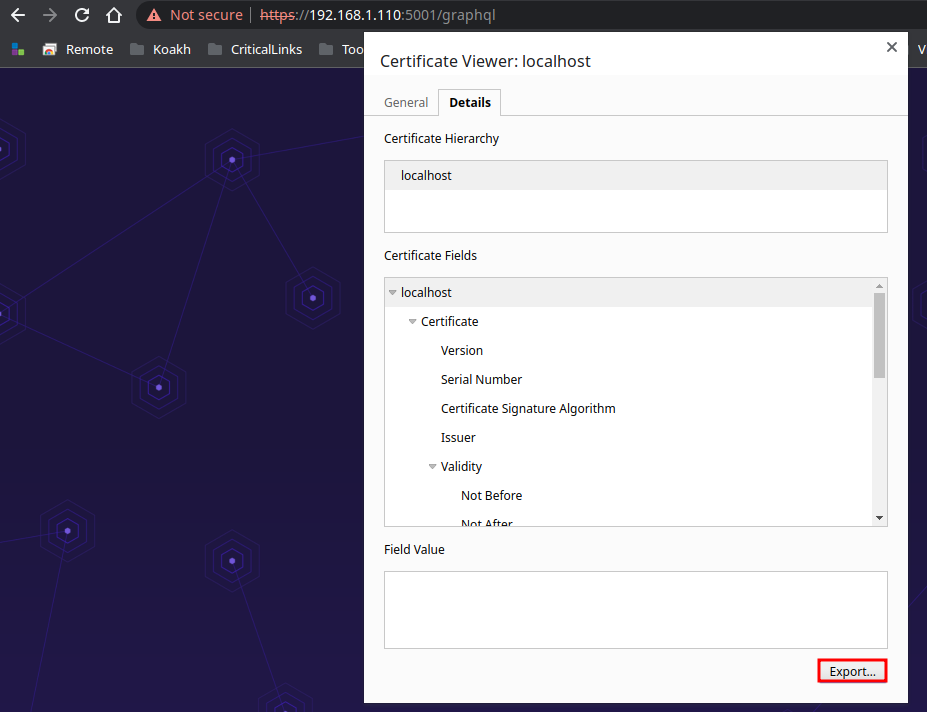
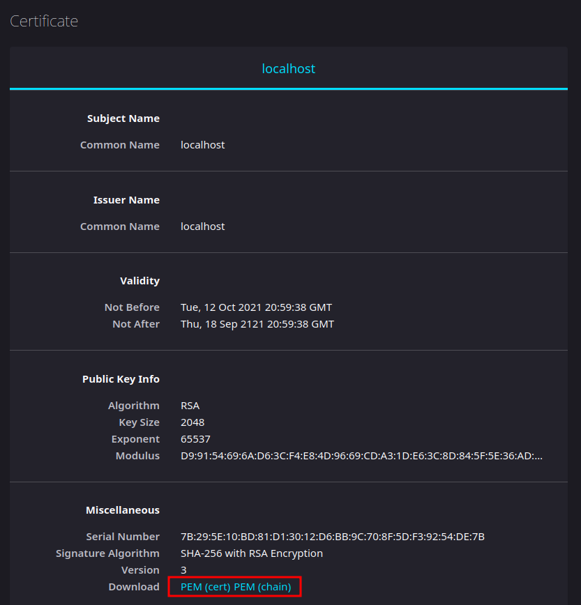
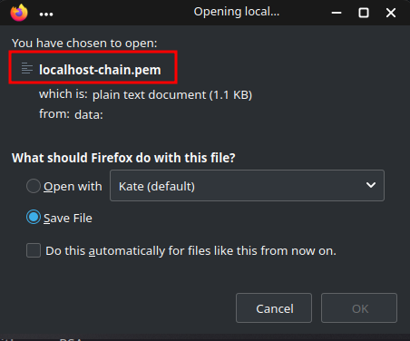
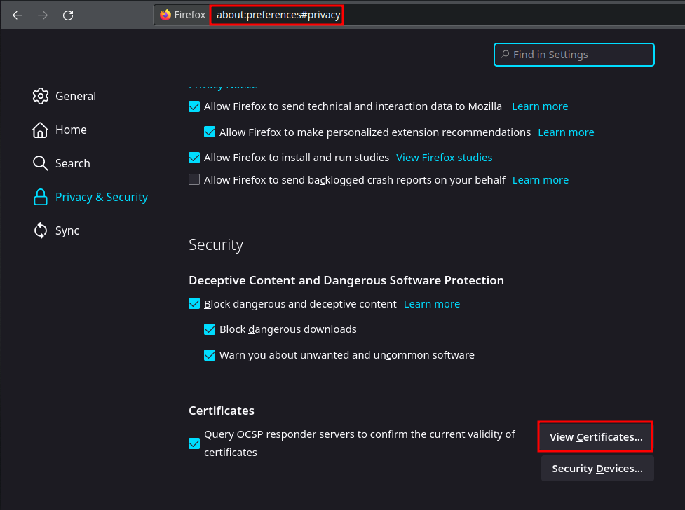
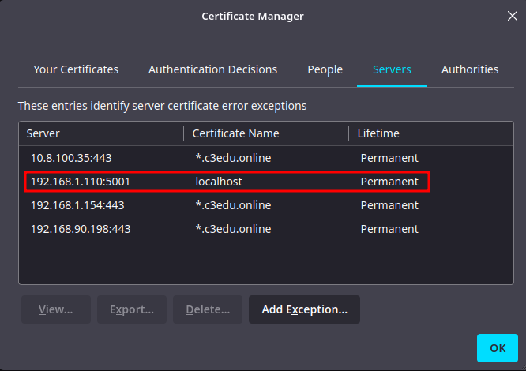

# NOTES

- [NOTES](#notes)
	- [TLDR](#tldr)
	- [Links](#links)
		- [Autenticação.gov](#autenticaçãogov)
		- [Tooling](#tooling)
		- [SpringBoot](#springboot)
			- [Spring Guide: React.js and Spring Data REST](#spring-guide-reactjs-and-spring-data-rest)
			- [CORS: Fix Cross-Origin Request Blocked: The Same Origin Policy disallows reading the remote resource](#cors-fix-cross-origin-request-blocked-the-same-origin-policy-disallows-reading-the-remote-resource)
			- [Base URL](#base-url)
		- [Java](#java)
			- [HttpsURLConnection : Read the Response From Input Stream](#httpsurlconnection--read-the-response-from-input-stream)
			- [HttpsURLConnection : Read the Response From Input Stream](#httpsurlconnection--read-the-response-from-input-stream-1)
			- [Certificates and Thrust Store](#certificates-and-thrust-store)
			- [Jackson ObjectMapper](#jackson-objectmapper)
	- [Create Project with Spring initialzr](#create-project-with-spring-initialzr)
	- [Use pteidlibj in project](#use-pteidlibj-in-project)
	- [React Frontend with CRA and Typescript](#react-frontend-with-cra-and-typescript)
		- [1. create a cra app ex in .cra](#1-create-a-cra-app-ex-in-cra)
		- [2. create folder `frontend` and copy cra files into it](#2-create-folder-frontend-and-copy-cra-files-into-it)
		- [3. edit `pom.xml` and add **building and packaging** maven plugins](#3-edit-pomxml-and-add-building-and-packaging-maven-plugins)
		- [4 add `src/main/java/com/solidarychain/citizencardreaderapi/config/WebMvcConfig.java`, this will do the magic trick to prefix all `@RestController` annotated controllers with `/api`, and leaving `/` free for serve frontend](#4-add-srcmainjavacomsolidarychaincitizencardreaderapiconfigwebmvcconfigjava-this-will-do-the-magic-trick-to-prefix-all-restcontroller-annotated-controllers-with-api-and-leaving--free-for-serve-frontend)
	- [React WebSockets/Stomp](#react-websocketsstomp)
	- [Add MUI](#add-mui)
	- [GrapqhQL Api Notes](#grapqhql-api-notes)
		- [Some Requests](#some-requests)
	- [Fix Failed to execute goal com.github.eirslett:frontend-maven-plugin:1.6:yarn (yarn build)](#fix-failed-to-execute-goal-comgithubeirslettfrontend-maven-plugin16yarn-yarn-build)
	- [Spring Boot Application as a Service](#spring-boot-application-as-a-service)
		- [Unable to find a suitable main class, please add a 'mainClass' property -> [Help 1]](#unable-to-find-a-suitable-main-class-please-add-a-mainclass-property---help-1)
- [A fatal error has been detected by the Java Runtime Environment:](#a-fatal-error-has-been-detected-by-the-java-runtime-environment)
- [SIGSEGV (0xb) at pc=0x00007fa0a9ec5c14, pid=9039, tid=9126](#sigsegv-0xb-at-pc0x00007fa0a9ec5c14-pid9039-tid9126)
- [JRE version: OpenJDK Runtime Environment (11.0.11+9) (build 11.0.11+9-Ubuntu-0ubuntu2.20.04)](#jre-version-openjdk-runtime-environment-110119-build-110119-ubuntu-0ubuntu22004)
- [Java VM: OpenJDK 64-Bit Server VM (11.0.11+9-Ubuntu-0ubuntu2.20.04, mixed mode, sharing, tiered, compressed oops, g1 gc, linux-amd64)](#java-vm-openjdk-64-bit-server-vm-110119-ubuntu-0ubuntu22004-mixed-mode-sharing-tiered-compressed-oops-g1-gc-linux-amd64)
- [Problematic frame:](#problematic-frame)
- [V  [libjvm.so+0x564c14]](#v--libjvmso0x564c14)
- [get path](#get-path)

## TLDR

```shell
$ git clone https://github.com/koakh/SpringBootCitizenCardReaderRestService.git
$ ./mvnw install
$ ./mvnw spring-boot:run
$ curl localhost:8080/api/card/read
```

## Links

### Autenticação.gov

- https://amagovpt.github.io/docs.autenticacao.gov/manual_sdk.html#linux
- 
- [pt.gov.cartaodecidadao:pteidlib v3.5.0](https://amagovpt.github.io/docs.autenticacao.gov/sdk/java/overview-summary.html)

- [X] Get events for insertion and removal of cards
- [X] Get identification information
- [-] Get citizen picture file
- [-] Get address information
- [-] How to read or write personal notes
- [-] Signatures with eID card (citizen signature certificate)
- [-] How to sign PDF documents (PAdES)
- [-] How to sign any type of file (XAdES signature format)
- [-] Timestamp Server configuration
- [-] Verify a PAdES signature
- [-] Verify a XAdES signature

### Tooling

- [Java in Visual Studio Code](https://code.visualstudio.com/docs/languages/java)
- [How to Use Visual Studio Code with Java?](https://www.baeldung.com/java-visual-studio-code)

### SpringBoot

#### Spring Guide: React.js and Spring Data REST

- [React.js and Spring Data REST](https://spring.io/guides/tutorials/react-and-spring-data-rest/)
- [Repo](https://github.com/eugenp/tutorials/tree/master/spring-boot-modules/spring-boot-react)

- `located@koakh-laptop:/home/mario/Development/SpringBoot/tut-react-and-spring-data-rest`

#### CORS: Fix Cross-Origin Request Blocked: The Same Origin Policy disallows reading the remote resource

fix ws : `cors Cross-Origin Request Blocked: The Same Origin Policy disallows reading the remote resource at http://localhost:8080/handler/info?t=1635372697890. (Reason: CORS request did not succeed).`

- [25.2.1 Create and Configure a WebSocketHandler](https://docs.spring.io/spring-framework/docs/4.2.4.RELEASE/spring-framework-reference/html/websocket.html#websocket-server-handler)
- [25.2.6 Configuring allowed origins](https://docs.spring.io/spring-framework/docs/4.2.4.RELEASE/spring-framework-reference/html/websocket.html#websocket-server-allowed-origins)

#### Base URL

How to set base url for rest in spring boot?

- [How to set base url for rest in spring boot?: answear](https://stackoverflow.com/a/58256259)

> this will leave `/` for react and thymeleaft if we need it and `/api` for all annotated `RestControllers`

check `src/main/java/com/solidarychain/citizencardreaderapi/config/WebMvcConfig.java`

### Java

#### HttpsURLConnection : Read the Response From Input Stream

- [Read the Response From Input Stream](https://www.baeldung.com/httpurlconnection-post#8-read-the-response-from-input-stream)

#### HttpsURLConnection : Read the Response From Input Stream

- [Como corrigir o erro "Java.security.cert.CertificateException: No subject alternative names present"?](https://www.ti-enxame.com/pt/java/como-corrigir-o-erro-java.security.cert.certificateexception-no-subject-alternative-names-present/1043257709/)


```java
public static void disableHttpsVerification(String host) {
  javax.net.ssl.HttpsURLConnection.setDefaultHostnameVerifier(new javax.net.ssl.HostnameVerifier() {
    public boolean verify(String hostname, javax.net.ssl.SSLSession sslSession) {
      return hostname.equals(host);
    }
  });
}
```

create a helper function, and use it before request's

```java
public static void graphql(String fqdn, String serverUi) {
  // disable https verification on host
  disableHttpsVerification(fqdn);
```

#### Certificates and Thrust Store

this problem occurs when call `HttpUtils.graphql` to request unprotected graphql api (without valid certificate)

- [Java: sun.security.provider.certpath.SunCertPathBuilderException: unable to find valid certification path to requested target](https://stackoverflow.com/questions/6908948/java-sun-security-provider-certpath-suncertpathbuilderexception-unable-to-find)
- [answear](https://stackoverflow.com/a/59596185)

There is a lot of way to solve this..., One way is set the TrustStore certificates in a keystore file and put it in the path of the application, and set these system properties in the main method:

```shell
# first start the grapqhql api
$ cd ~/Development/Neo4j/TypescriptNodeNeo4jGraphqlLibraryStarter
$ npm run neo4j-gqllib-starter:server
```

**download certificate with firefox** and copy to project path

with chromium







with firefox






with firefox settings, open firefox in `about:preferences#privacy`, note certificate only appear if we accept it





```shell
$ cat localhost-chain.pem
-----BEGIN CERTIFICATE-----
MIIDCzCCAfOgAwIBAgIUeyleEL2B0TAS1ruccI9d85JU3nswDQYJKoZIhvcNAQEL
BQAwFDESMBAGA1UEAwwJbG9jYWxob3N0MCAXDTIxMTAxMjIwNTkzOFoYDzIxMjEw
OTE4MjA1OTM4WjAUMRIwEAYDVQQDDAlsb2NhbGhvc3QwggEiMA0GCSqGSIb3DQEB
AQUAA4IBDwAwggEKAoIBAQDZkVRpatY89OhNlmnNox3mPI2EX142rURmWG5i0EI/
UI2+fZtJAD20rpZAMTLyDhQxD5DnB8Ca6Mq9ZPSebYMUmf+zXvS87PwyE0iFj8Rz
7QPr2Mck7GWe3EXCaDL2FofKk0nJnX7U2gF5ALRd5ozKDyGb/PDu/yPftr6T5+mW
qlBzuyTwcN5rg78IbP4pXtD53OYdh5erg4vtOht61ptQ4eWpBs+Nt/otvijCsDXm
S8thn8IHVeVsIr+60y7wQMImy7I2xYu1DIfTPqvlhDVMyQ8yH7nvYkMnMVdHFGWB
ctz0fbQnMenYyvtqrDtTxVF+Gt7LHhG8QcGabF+4049XAgMBAAGjUzBRMB0GA1Ud
DgQWBBR2S2xH3RSKwF/WIiBtTzFEh8WuQDAfBgNVHSMEGDAWgBR2S2xH3RSKwF/W
IiBtTzFEh8WuQDAPBgNVHRMBAf8EBTADAQH/MA0GCSqGSIb3DQEBCwUAA4IBAQBg
uLCgQDgzA56QtbtpuRLvGV50Xh4jATqXDckusrD8SlYF2+pCY325EpyCzBqJeEWQ
8dpiNQuGGFfFFy6Mv+Um0mqLvdvxfOZfwTgdBSWwEKORh9KCrZ6l0yNhUlVZuqjR
f3OQ5gE+w27SO6OPS9YivKHc1ShnOoejkWZCHXd3yQGt+hc1zQoWpUAuc7GUNuB6
K929fMetXpi3qGBOw92BkJeQvl7WxpVoTLq/lLMuyoVzurqK0OTN4+H1iwPIaS8P
AWjGx38Iz+OMT2auN46wX+t/lqkDxUTLXTuStflZZX1fQpaJV95O7f4rDQFyw9YJ
oPQNU34zpvIMFKTyGyGq
-----END CERTIFICATE-----
```

now create `trust-store.jks`

```shell
$ scp /home/mario/Downloads/localhost* 192.168.122.160:/home/mario/Development/SpringBootCitizenCardReaderRestService
$ keytool -import -alias ca -keystore trust-store.jks -storepass TrustStore -trustcacerts -file localhost-chain.pem
Owner: CN=localhost
Issuer: CN=localhost
Serial number: 7b295e10bd81d13012d6bb9c708f5df39254de7b
Valid from: Tue Oct 12 20:59:38 UTC 2021 until: Thu Sep 18 20:59:38 UTC 2121
```

note from post `I created the keystore file **from a Certificate authority CA .crt** file in this way:`

```shell
$ keytool -import -alias ca -keystore trust-store.jks -storepass TrustStore -trustcacerts -file ca.crt
```

- [Java: sun.security.provider.certpath.SunCertPathBuilderException: unable to find valid certification path to requested target](https://stackoverflow.com/questions/6908948/java-sun-security-provider-certpath-suncertpathbuilderexception-unable-to-find)

now add to `src/main/java/com/solidarychain/citizencardreaderapi/Application.java`

```java
@SpringBootApplication
public class Application {
	public static void main(String[] args) {
    System.setProperty("javax.net.ssl.trustStore", "trust-store.jks");
    System.setProperty("javax.net.ssl.trustStorePassword", "TrustStore");
	}
}
```

done now we can connect to grapqhql api without a valid certificate

#### Jackson ObjectMapper

- [Intro to the Jackson ObjectMapper](https://www.baeldung.com/jackson-object-mapper-tutorial)

## Create Project with Spring initialzr

- [Building an Application with Spring Boot](https://spring.io/guides/gs/spring-boot/)

```shell
$ ./mvnw spring-boot:run

$ curl localhost:8080
Greetings from Spring Boot!
```

## Use pteidlibj in project

- [Add external library .jar to Spring boot .jar internal /lib](https://stackoverflow.com/questions/30207842/add-external-library-jar-to-spring-boot-jar-internal-lib)

the trick is JUST using `/usr/local/lib/pteid_jni/pteidlibj.jar` builded from `autenticacao.gov` project

read the notes from `autenticacao.gov`

- CitizenCard.md
- Armbian : TX9 Pro and MagicSee.md

TLDR: Clone autenticacao.gov build and install, after it

check presence of pteidlibj.jar with

```shell
$ ls /usr/local/lib/pteid_jni/pteidlibj.jar
/usr/local/lib/pteid_jni/pteidlibj.jar
```

add to `Application.java`

```java
import pt.gov.cartaodecidadao.*;
  ...
  System.loadLibrary("pteidlibj");
```

```xml
	<dependencies>
		<!-- require to use pteidlibj -->
		<dependency>
			<groupId>pt.gov.cartaodecidadao</groupId>
			<artifactId>pteidlibj</artifactId>
			<version>1.0.0</version>
			<scope>system</scope>
			<systemPath>${basedir}/libs/arm64/pteidlibj.jar</systemPath>
		</dependency>
	</dependencies>

	<build>
		<plugins>
			<plugin>
				<groupId>org.springframework.boot</groupId>
				<artifactId>spring-boot-maven-plugin</artifactId>
				<configuration>
					<environmentVariables>
						<LD_LIBRARY_PATH>/usr/local/lib</LD_LIBRARY_PATH>
					</environmentVariables>
					<systemPropertyVariables>
						<java.library.path>/usr/local/lib</java.library.path>
					</systemPropertyVariables>
```

add to `.vscode/settings.json`

```json
{
  "pasteImageToMarkdown.path": "./attachments",
  "java.configuration.updateBuildConfiguration": "automatic",
  "java.project.referencedLibraries": [
    "lib/**/*.jar",
    // "/usr/local/lib/pteid_jni/pteidlibj.jar",
    "/usr/local/lib/**/*.jar"
  ],
}
```

now clean and run

```shell
$ ./mvnw clean
$ ./mvnw spring-boot:run
...
# now we have lib working
18:44:51.077 [main] DEBUG com.solidarychain.citizencardreaderapi.Application - java version 11.0.11
18:44:51.079 [main] DEBUG com.solidarychain.citizencardreaderapi.Application - java library path /usr/local/lib
18:44:51.152 [main] DEBUG com.solidarychain.citizencardreaderapi.Application - pteidlibj loaded
...
readerCount 1
card isActive true
Card inserted...
{ documentVersion:'006.007.23', documentType:'Cartão de Cidadão', 
```

## React Frontend with CRA and Typescript

- [CRUD Application With React and Spring Boot](https://www.baeldung.com/spring-boot-react-crud)

### 1. create a cra app ex in .cra

### 2. create folder `frontend` and copy cra files into it

### 3. edit `pom.xml` and add **building and packaging** maven plugins

```shell
<?xml version="1.0" encoding="UTF-8"?>
<project xmlns="http://maven.apache.org/POM/4.0.0" xmlns:xsi="http://www.w3.org/2001/">	<properties>
		<!-- react frontend -->
		<frontend-maven-plugin.version>1.6</frontend-maven-plugin.version>
		<maven-resources-plugin.version>3.1.0</maven-resources-plugin.version>
		<node.version>v14.18.0</node.version>
		<yarn.version>v1.12.1</yarn.version>
    ...
	</dependencies>
	<build>
		<plugins>
			<!-- react frontend -->
			<plugin>
				<artifactId>maven-resources-plugin</artifactId>
				<version>${maven-resources-plugin.version}</version>
				<executions>
					<execution>
						<id>copy-resources</id>
						<phase>process-classes</phase>
						<goals>
							<goal>copy-resources</goal>
						</goals>
						<configuration>
							<!-- <outputDirectory>${basedir}/target/classes/static</outputDirectory> -->
							<outputDirectory>${basedir}/src/main/resources/META-INF/resources</outputDirectory>
							<resources>
								<resource>
									<directory>${project.basedir}/frontend/build</directory>
								</resource>
							</resources>
						</configuration>
					</execution>
				</executions>
			</plugin>
			<plugin>
				<groupId>com.github.eirslett</groupId>
				<artifactId>frontend-maven-plugin</artifactId>
				<version>${frontend-maven-plugin.version}</version>
				<configuration>
					<workingDirectory>frontend</workingDirectory>
				</configuration>
				<executions>
					<execution>
						<id>install node</id>
						<goals>
							<goal>install-node-and-yarn</goal>
						</goals>
						<configuration>
							<nodeVersion>${node.version}</nodeVersion>
							<yarnVersion>${yarn.version}</yarnVersion>
						</configuration>
					</execution>
					<execution>
						<id>yarn install</id>
						<goals>
							<goal>yarn</goal>
						</goals>
						<phase>generate-resources</phase>
					</execution>
					<execution>
						<id>yarn test</id>
						<goals>
							<goal>yarn</goal>
						</goals>
						<phase>test</phase>
						<configuration>
							<arguments>test</arguments>
							<environmentVariables>
								<CI>true</CI>
							</environmentVariables>
						</configuration>
					</execution>
					<execution>
						<id>yarn build</id>
						<goals>
							<goal>yarn</goal>
						</goals>
						<phase>compile</phase>
						<configuration>
							<arguments>build</arguments>
						</configuration>
					</execution>
				</executions>
			</plugin>
```

> note for `<outputDirectory>${basedir}/src/main/resources/META-INF/resources</outputDirectory>` this will build react frontend in `resources/META-INF/resources` path, that will be server as `http://localhost:8080`

### 4 add `src/main/java/com/solidarychain/citizencardreaderapi/config/WebMvcConfig.java`, this will do the magic trick to prefix all `@RestController` annotated controllers with `/api`, and leaving `/` free for serve frontend

```java
@Override
public void configurePathMatch(PathMatchConfigurer configurer) {
  configurer.addPathPrefix("api", HandlerTypePredicate.forAnnotation(RestController.class));
}
```

## React WebSockets/Stomp

- [react-stomp](https://www.npmjs.com/package/react-stomp)

> A working implementation using Spring Boot and react-talk can be found at [spring-websocket-template](https://github.com/lahsivjar/spring-websocket-template/tree/master/with-sockjs)

- [react-stomp-hooks](https://www.npmjs.com/package/react-stomp-hooks)


```shell
$ cd frontend
$ npm install --save react-stomp-hooks
```

## Add MUI

- [Install MUI, the world's most popular React UI framework](https://mui.com/getting-started/installation/)
- [Roboto Font](https://mui.com/components/typography/#general)


```shell
# MUI

# with npm
$ npm install @mui/material @emotion/react @emotion/styled
# with yarn
$ yarn add @mui/material @emotion/react @emotion/styled

# Roboto Font

# with npm
$ npm install @fontsource/roboto
# with yarn
$ yarn add @fontsource/roboto

# SVG icons
# with npm
$ npm install @mui/icons-material

# with yarn
$ yarn add @mui/icons-material
```

Then, you can import it in your entry-point.

```typescript
import '@fontsource/roboto/300.css';
import '@fontsource/roboto/400.css';
import '@fontsource/roboto/500.css';
import '@fontsource/roboto/700.css';
```


## GrapqhQL Api Notes

### Some Requests

```shell
$ HOST="127.0.0.1:5001"
$ HOST="192.168.1.110:5001"
$ EMAIL="admin@admin.com"
$ PASSWORD="password"
$ ACCESS_TOKEN=$(curl -k -s -X POST \
  --url "https://${HOST}/graphql" \
  --header 'content-type: application/json' \
  --header 'user-agent: vscode-restclient' \
  --data '{"query":"mutation SignInMutation($signUpEmail: String!, $signUpPassword: String!) { signIn(email: $signUpEmail, password: $signUpPassword)}","variables":{"signUpEmail":"'${EMAIL}'","signUpPassword":"'${PASSWORD}'" } }' \
	| jq -r ".data .signIn")

$ EMAIL="jane@mail.com"
$ curl -k -s -X POST \
	--header "Authorization: Bearer ${JWT}" \
	--header "content-type: application/json" \
	--url https://${HOST}/graphql \
	--data '{ "query" : "mutation CreateUsersMutation($input: [UserCreateInput!]!) { createUsers(input: $input) { users { id email roles } } }","variables":"{ \"input\": { \"email\": \"'${EMAIL}'\", \"roles\": \"ROLE_USER\" } }"}' \
	| jq
{
  "data": {
    "createUsers": {
      "users": [
        {
          "id": "3c011f8d-d070-47b0-863a-181ba41d4e68",
          "email": "jane@mail.com",
          "roles": [
            "ROLE_USER"
          ]
        }
      ]
    }
  }
}
```

## Fix Failed to execute goal com.github.eirslett:frontend-maven-plugin:1.6:yarn (yarn build)

- [error:0308010C:digital envelope routines::unsupported](https://stackoverflow.com/questions/69692842/error0308010cdigital-envelope-routinesunsupported)

```shell
$ ./mvnw clean package
[ERROR] Failed to execute goal com.github.eirslett:frontend-maven-plugin:1.6:yarn (yarn build) on project citizencardreaderapi: Failed to run task: 'yarn build' failed. org.apache.commons.exec.ExecuteException: Process exited with an error: 1 (Exit value: 1) -> [Help 1]

# build manually first
$ cd frontend
$ yarn build
Error: error:0308010C:digital envelope routines::unsupported
$ cd ..
$ ./mvnw package
```

fix adding to script `"build": "NODE_OPTIONS=--openssl-legacy-provider react-scripts build"`

## Spring Boot Application as a Service

- [Spring Boot Application as a Service](https://www.baeldung.com/spring-boot-app-as-a-service)

```shell
$ SERVICE_USER=ccservice
$ sudo useradd ${SERVICE_USER}
$ sudo passwd ${SERVICE_USER}
$ sudo chown ${SERVICE_USER}:${SERVICE_USER} your-app.jar
$ sudo chmod 500 your-app.jar
```

TODO: create script in `Makefile` and `ccserver.service`

### Unable to find a suitable main class, please add a 'mainClass' property -> [Help 1]

[ERROR] Failed to execute goal org.springframework.boot:spring-boot-maven-plugin:2.5.5:run (default-cli) on project citizencardreaderapi: Unable to find a suitable main class, please add a 'mainClass' property -> [Help 1]

- https://stackoverflow.com/questions/32368328/unable-to-find-a-suitable-main-class-please-add-a-mainclass-property-spring

fixe with

```shell
$ ./mvnw install
$ make run
```


https://stackoverflow.com/questions/32112007/how-to-resolve-java-lang-noclassdeffounderror-in-java
https://stackoverflow.com/questions/10935135/maven-and-adding-jars-to-system-scope


#
# A fatal error has been detected by the Java Runtime Environment:
#
#  SIGSEGV (0xb) at pc=0x00007fa0a9ec5c14, pid=9039, tid=9126
#
# JRE version: OpenJDK Runtime Environment (11.0.11+9) (build 11.0.11+9-Ubuntu-0ubuntu2.20.04)
# Java VM: OpenJDK 64-Bit Server VM (11.0.11+9-Ubuntu-0ubuntu2.20.04, mixed mode, sharing, tiered, compressed oops, g1 gc, linux-amd64)
# Problematic frame:
# V  [libjvm.so+0x564c14]

this happens if we have a card insert......seems that occurs when try read card

it was the offending line 

this.context.SetEventCallback(
  new CardEventsCallback(() -> this.cardInsertedEvent(), () -> this.cardRemovedEvent()), null);


https://www.cyberciti.biz/faq/install-java-on-ubuntu-20-04-linux/

$ apt-cache --names-only search 'openjdk-[0-9]*-(jre|jdk)' | sort -t '-' -k 2 -n

$ sudo apt install openjdk-17-jre-headless
Reading package lists... Done
Building dependency tree       
Reading state information... Done
openjdk-17-jre-headless is already the newest version (17+35-1~20.04).
openjdk-17-jre-headless set to manually installed.
0 upgraded, 0 newly installed, 0 to remove and 10 not upgraded.

$  java --version
openjdk 17 2021-09-14
OpenJDK Runtime Environment (build 17+35-Ubuntu-120.04)
OpenJDK 64-Bit Server VM (build 17+35-Ubuntu-120.04, mixed mode, sharing)


# get path
sudo update-alternatives --config java
sudo nano /etc/environment
JAVA_HOME="/usr/lib/jvm/java-11-openjdk-amd64/bin/java"
source /etc/environment


https://docs.spring.io/spring-boot/docs/current/maven-plugin/reference/htmlsingle/#?


./mvnw spring-boot:repackage
[WARNING] 'dependencies.dependency.systemPath' for pt.gov.cartaodecidadao:pteidlibj:jar should not point at files within the project directory, ${basedir}/libs/arm64/pteidlibj.jar will be unresolvable by dependent projects @ line 51, column 16
